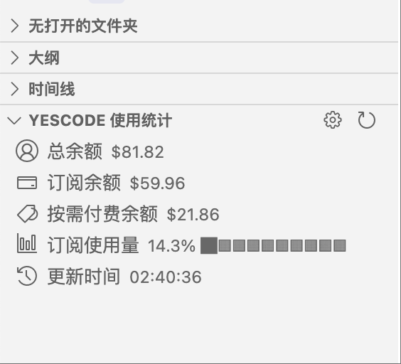
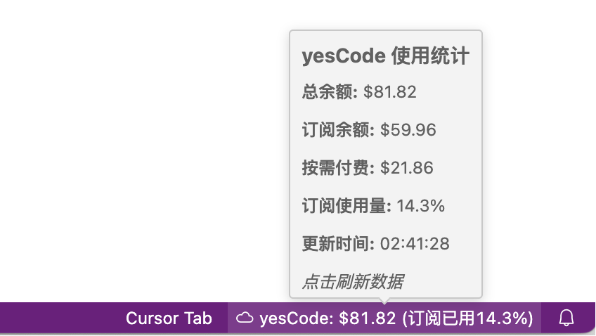

# yesCode Stats

监控 yesCode Claude API 使用量的 VS Code 扩展插件。

[](https://marketplace.visualstudio.com/items?itemName=StevenQi.yescode-stats)
[](https://github.com/StevenQi7/yesCode-Stats/blob/main/LICENSE)

## 功能特性

- 📊 **实时监控**：状态栏和侧边栏双重显示
- 💰 **余额追踪**：总余额、订阅余额、按需付费余额
- 📈 **使用统计**：订阅使用百分比及进度条
- 🔐 **安全存储**：API Token 存储在 VS Code 密钥库
- 🔄 **自动刷新**：支持多种刷新周期

## 效果展示

### 侧边栏视图


### 状态栏显示


## 安装

### 从 VS Code 市场安装（推荐）

1. 在 VS Code 扩展市场搜索 "yesCode Stats"
2. 点击安装
3. 或者使用命令：`ext install StevenQi.yescode-stats`

### 从源码安装

```bash
# 克隆项目
git clone https://github.com/StevenQi7/yesCode-Stats.git
cd yesCode-Stats

# 安装依赖
npm install

# 在 VS Code 中按 F5 运行
```

### 初次使用

插件首次运行会自动弹出设置向导：

1. 输入 API Token（格式：`cr_xxxxxxx`）
2. 设置每日订阅额度（默认 $100）

如果跳过初始设置，可以：
- 点击侧边栏 ⚙️ 设置按钮
- 使用命令 `yesCode: 设置`

## 界面说明

### 状态栏（右下角）
显示：`yesCode: $117.74 (订阅已用4.1%)`

### 侧边栏（资源管理器）
```
yesCode 使用统计
├── 总余额: $117.74
├── 订阅余额: $95.88
├── 按需付费余额: $21.86
├── 订阅使用量: 4.1% ██░░░░░░░░
└── 更新时间: 14:25:30
```

## 配置说明

| 配置项 | 说明 | 默认值 |
|--------|------|--------|
| API Token | yesCode API 密钥 | - |
| API 地址 | 数据接口地址 | https://co.yes.vg/api/v1/claude/balance |
| 刷新周期 | 10秒/30秒/1分钟/5分钟/30分钟 | 1分钟 |
| 每日订阅额度 | 用于计算使用百分比 | $100 |

## 开发

```bash
npm run compile  # 编译
npm run watch    # 监视模式
npm run lint     # 代码检查
```

## 常见问题

**Q: 看不到设置按钮？**  
A: 在资源管理器中展开 "yesCode 使用统计" 面板，按钮在标题栏右侧。

**Q: 订阅使用量如何计算？**  
A: 使用量 = (每日额度 - 当前余额) / 每日额度 × 100%

**Q: API Token 安全吗？**  
A: Token 存储在 VS Code 密钥库中，不会保存在配置文件。

## License

Apache-2.0